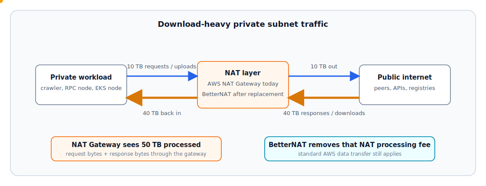
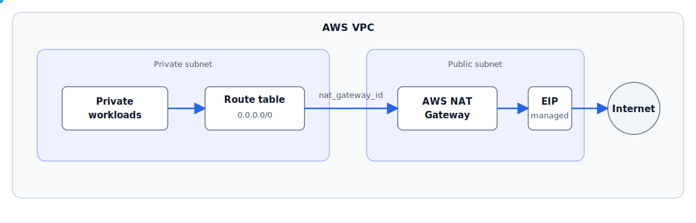
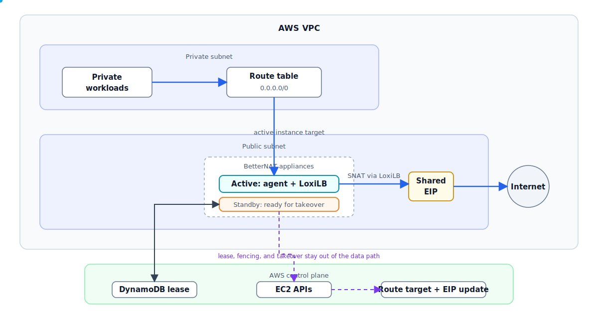

# BetterNAT

Self-owned, observable, highly available egress for high-volume AWS private subnet workloads.

**Alpha technical preview.** Start with the [documentation index](docs/README.md), then follow the [Quick Start](docs/user/QUICK_START.md), [Cost Model](docs/user/COST_MODEL.md), [Operations Guide](docs/user/OPERATIONS_GUIDE.md), and [Limitations](docs/user/LIMITATIONS.md).

BetterNAT targets the NAT Gateway bill line that hurts at scale: per-GB data processing. It is built for crawler fleets, blockchain/RPC nodes syncing from public peers, Kubernetes nodes pulling large public images, and other private workloads that download tens of TB per month from the public internet.

Better not be surprised by NAT Gateway bills.

## Why BetterNAT

AWS [NAT Gateway pricing](https://docs.aws.amazon.com/vpc/latest/userguide/nat-gateway-pricing.html) charges for each hour it is available and each GB it processes. The [AWS VPC pricing page](https://aws.amazon.com/vpc/pricing/) also states that data processing charges apply for each GB processed through NAT Gateway regardless of traffic source or destination, and standard data transfer charges still apply.

For private-subnet download-heavy workloads, this matters:



The large response returns through NAT Gateway and contributes to processed GB. BetterNAT replaces that managed per-GB NAT processing fee with a self-managed EC2 node pool.

Direction matters. NAT Gateway processing is metered on both request bytes and response bytes through the gateway. BetterNAT has no equivalent per-GB NAT processing fee; after replacement, the remaining AWS data-transfer bill depends on traffic direction. That is why BetterNAT is especially strong for workloads that send small requests and pull large responses into AWS.

Example: `50 TB/month` through the NAT layer, `80%` ingress/download into the private workload and `20%` egress/upload out to the internet.

| Monthly estimate | NAT Gateway design | BetterNAT design |
| --- | ---: | ---: |
| NAT processing + gateway/node | about `$2,337` | about `$73` |
| Standard internet egress transfer on 10 TB | about `$922` | about `$922` |
| Example total | about `$3,258/month` | about `$995/month` |
| Example savings |  | about `$2,264/month` (`69%`) |

Assumptions: `$0.045/GB` NAT Gateway processing, `$0.045/hour` for one NAT Gateway, two `$0.05/hour` BetterNAT nodes, `730` hours/month, and illustrative `$0.09/GB` standard internet egress transfer. The example excludes EBS, EIP/public IPv4, DynamoDB, monitoring, and operational cost. See [Cost Model](docs/user/COST_MODEL.md) for direction examples, formulas, caveats, and CLI usage.

## What You Get

- Lower NAT Gateway processing cost for suitable high-volume workloads.
- Stable egress IP failover mode with a shared EIP.
- ASG-backed node pool with active/standby ownership.
- LoxiLB/eBPF datapath for node-local SNAT.
- DynamoDB lease/fencing for route and EIP ownership.
- Prometheus metrics for HA, datapath, traffic counters, and failover state.
- Terraform provider install UX through `nowakeai/betternat`.
- Rollback-oriented route ownership model for existing VPC adoption.

## Quick Start

Use the Terraform Registry provider:

```hcl
terraform {
  required_providers {
    betternat = {
      source  = "nowakeai/betternat"
      version = "= 0.1.0-alpha.2"
    }
  }
}
```

Provider versions and BetterNAT runtime artifact versions are separate. The
current alpha provider is `0.1.0-alpha.2`; the current runtime release assets
referenced by the quick start are `v0.1.0-alpha.1`.

If your Terraform currently uses AWS NAT Gateway:

```hcl
resource "aws_eip" "nat" {
  domain = "vpc"
}

resource "aws_nat_gateway" "main" {
  allocation_id = aws_eip.nat.id
  subnet_id     = aws_subnet.public_a.id
}

resource "aws_route" "private_default" {
  route_table_id         = aws_route_table.private_a.id
  destination_cidr_block = "0.0.0.0/0"
  nat_gateway_id         = aws_nat_gateway.main.id
}
```

Replace it with BetterNAT:

```hcl
resource "betternat_gateway" "egress" {
  name   = "prod-egress-a"
  region = "us-west-2"
  vpc_id = aws_vpc.main.id

  public_subnet_ids = {
    "us-west-2a" = aws_subnet.public_a.id
  }

  private_route_table_ids = {
    "us-west-2a" = [aws_route_table.private_a.id]
  }

  private_cidrs = [aws_vpc.main.cidr_block]

  ami_id              = data.aws_ami.al2023_arm64.id
  instance_type       = "t4g.small"
  desired_capacity    = 2
  max_size            = 3
  stable_egress_ip    = true
  prometheus_enabled  = true
  rollback_on_destroy = true

  agent_binary_url    = var.agent_binary_url
  agent_binary_sha256 = var.agent_binary_sha256
  cli_binary_url      = var.cli_binary_url
  cli_binary_sha256   = var.cli_binary_sha256
}
```

BetterNAT owns the private default route after apply, so do not keep a separate `aws_route` resource managing the same `0.0.0.0/0` private route.

Before:



After:



For a disposable VPC run:

```sh
export AWS_PROFILE="<your-profile>"
export AWS_REGION="us-west-2"
export BETTERNAT_AZ="us-west-2a"
export BETTERNAT_VERSION="v0.1.0-alpha.1"
```

Then follow:

- [Quick Start](docs/user/QUICK_START.md) for release artifact setup, disposable VPC apply, verification, and destroy.
- [Existing VPC Install](docs/user/EXISTING_VPC_INSTALL.md) when you are ready to test against real route tables.
- [Configuration](docs/user/CONFIGURATION.md) for all `betternat_gateway` fields.

BetterNAT uses LoxiLB as the local datapath inside each node; see the [LoxiLB overview](https://github.com/loxilb-io/loxilb/assets/75648333/87da0183-1a65-493f-b6fe-5bc738ba5468) and [standalone mode docs](https://github.com/loxilb-io/loxilbdocs/blob/main/docs/standalone.md).

## Verify

Run on a gateway node through SSM:

```sh
betternat doctor --live --config /etc/betternat/agent.json
```

Check public egress from a private client:

```sh
curl -fsS https://checkip.amazonaws.com
```

Scrape metrics:

```text
http://<gateway-private-ip>:9108/metrics
```

Estimate the cost shape:

```sh
betternat cost estimate --gb 51200 --node-hourly 0.05 --nodes 2
```

## When To Use It

BetterNAT is worth evaluating when:

- NAT Gateway data processing fees dominate the bill.
- Private workloads pull or receive large amounts of public internet data.
- You can operate a small EC2 node pool.
- New-flow recovery after failover is acceptable.
- You want Prometheus metrics and node-local diagnostics.
- You can test in a disposable or non-critical VPC first.

Use AWS NAT Gateway instead when:

- you need AWS-managed service semantics and SLA,
- active connection preservation matters,
- multi-AZ managed NAT behavior is required immediately,
- you do not want to own EC2, IAM, routes, EIPs, DynamoDB, metrics, and rollback state.

## Architecture

BetterNAT deploys an Auto Scaling Group of gateway nodes in one AZ.

Each node runs:

- `betternat-agent`,
- LoxiLB in standalone mode,
- the `betternat` CLI,
- Prometheus metrics.

The active node owns:

- the DynamoDB lease,
- the private route table default route,
- the shared EIP when `stable_egress_ip=true`.

On failure, a standby node takes over by reconciling datapath state, claiming the EIP when configured, and replacing the private route target.

Architecture docs:

- [Architecture](docs/architecture.md)
- [Architecture Diagram](docs/architecture-diagram.md)
- [Failure Modes](docs/user/FAILURE_MODES.md)

## Alpha Status

`v0.1.0-alpha.1` is an early technical preview.

Current scope:

- AWS only.
- Single-AZ HA group.
- Terraform provider first.
- No published BetterNAT AMI in the first alpha.
- Install path is Terraform plus cloud-init bootstrap on an explicit Linux AMI.
- LoxiLB/eBPF is the datapath.
- New connections recover after failover; active connections may reset.
- No NAT Gateway equivalent SLA.
- High-volume savings are modeled, not proven by expensive multi-TB benchmark runs.

Read before using real route tables:

- [Limitations](docs/user/LIMITATIONS.md)
- [Rollback Guide](docs/user/ROLLBACK_GUIDE.md)
- [Upgrade And Replacement Guide](docs/user/UPGRADE_REPLACEMENT_GUIDE.md)
- [Security And Supply Chain Guide](docs/user/SECURITY_HARDENING.md)

## Documentation

- [Documentation Index](docs/README.md)
- [Cost Model](docs/user/COST_MODEL.md)
- [Operations Guide](docs/user/OPERATIONS_GUIDE.md)
- [Observability Guide](docs/user/OBSERVABILITY_GUIDE.md)
- [IAM Policy](docs/user/IAM_POLICY.md)
- [Release Notes](docs/user/RELEASE_NOTES_v0.1.0-alpha.1.md)

## Development

Use direct Go commands as the portable baseline.

Run tests:

```sh
GOCACHE=$PWD/tmp/go-build go test ./...
```

Build the Terraform provider:

```sh
GOCACHE=$PWD/tmp/go-build go build ./cmd/terraform-provider-betternat
```

The repo-local `./manage` script is an optional convenience wrapper, not the only supported workflow.

## License

BetterNAT is licensed under the Apache License 2.0. See [LICENSE](LICENSE).

Third-party notices are recorded in [THIRD_PARTY_NOTICES.md](THIRD_PARTY_NOTICES.md).
