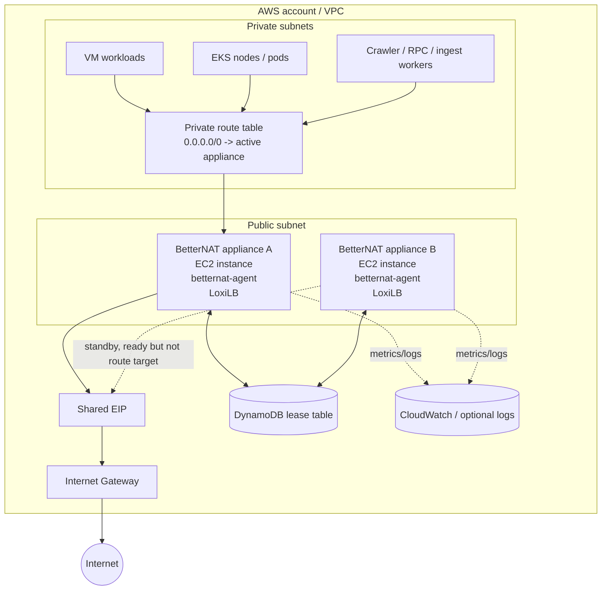
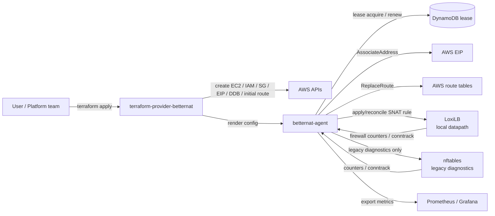
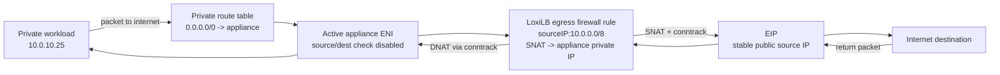
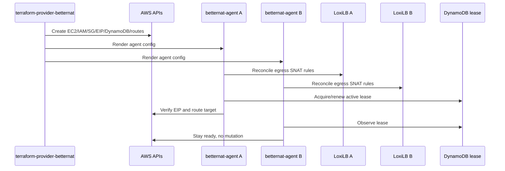
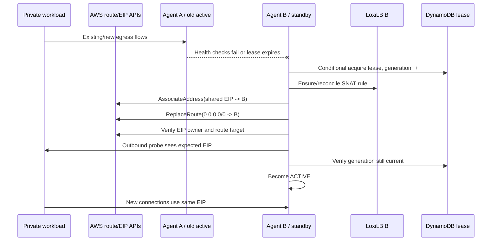
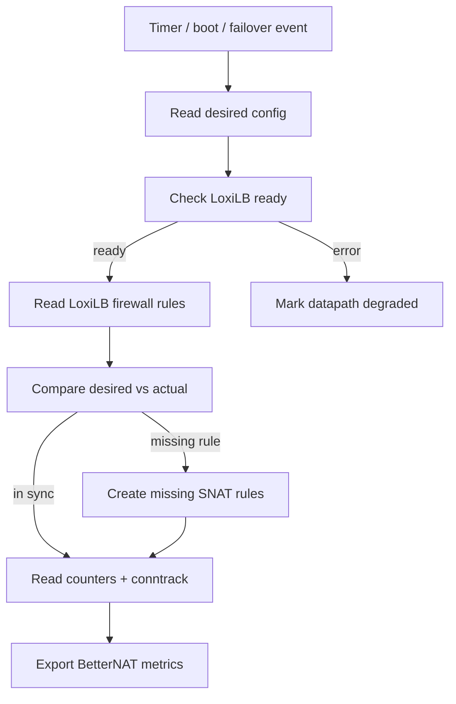

# BetterNAT Architecture Diagrams

Date: 2026-06-20

These diagrams show how BetterNAT, LoxiLB, and AWS work together.

BetterNAT-specific flows are shown as Mermaid diagrams so they stay versioned with this repository. For LoxiLB's upstream architecture and product visuals, see the LoxiLB project overview image and docs:

[](https://github.com/loxilb-io/loxilb)

- [LoxiLB architecture in brief](https://github.com/loxilb-io/loxilbdocs/blob/main/docs/arch.md)
- [LoxiLB standalone mode](https://github.com/loxilb-io/loxilbdocs/blob/main/docs/standalone.md)

In BetterNAT, LoxiLB is the local datapath on each appliance. BetterNAT owns Terraform UX, AWS route/EIP failover, DynamoDB lease/fencing, rollback, and normalized observability.

## 1. Deployment Topology



Key point:

- AWS route tables decide which appliance receives private-subnet egress traffic.
- AWS EIP decides the public source IP.
- LoxiLB only handles local packet forwarding/NAT on the appliance.
- BetterNAT owns AWS failover and runtime reconciliation.

## 2. Component Responsibilities



Ownership boundary:

| Layer | Owner |
| --- | --- |
| Terraform state and install lifecycle | `terraform-provider-betternat` |
| Runtime HA, lease, AWS failover | `betternat-agent` |
| Primary packet datapath | LoxiLB |
| Product fallback datapath | None; LoxiLB readiness is a release gate |
| Legacy diagnostics while retained | nftables/nf_conntrack |
| Metrics normalization | `betternat-agent` |
| Cloud primitives | AWS APIs |

## 3. Data Plane



Validated LoxiLB rule shape:

```sh
loxicmd create firewall \
  --firewallRule=sourceIP:<private-cidr>,preference:<priority> \
  --snat=<appliance-private-ip> \
  --egress
```

## 4. Control Plane Calls



## 5. Failover Sequence



v0 failover contract:

- New connections recover through the standby appliance.
- Public egress IP remains stable when shared EIP mode is enabled.
- Active connection preservation is not promised.

## 6. Runtime Reconciliation Loop



Reason this loop is required:

- In the spike, LoxiLB firewall rules disappeared after `docker restart loxilb`.
- BetterNAT must treat LoxiLB runtime config as ephemeral.
- Desired state belongs to `betternat-agent` config and is continuously reconciled.
