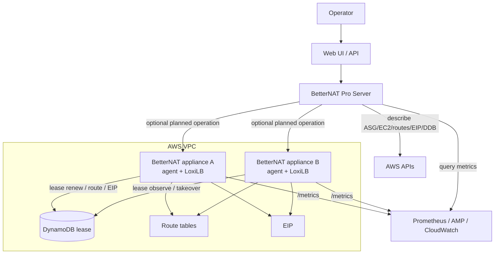

# BetterNAT Pro Edition Product Plan

Date: 2026-06-21

## Question

Should BetterNAT have a future Pro edition, and what should it include without making the open-source v0 gateway appliance more complex or fragile?

## Short Answer

Yes. BetterNAT should keep the v0/open-source runtime decentralized and appliance-local:

- `betternat-agent` on every gateway instance,
- local CLI diagnostics,
- Prometheus `/metrics`,
- Terraform provider install lifecycle,
- AWS-native ASG/DynamoDB/route/EIP primitives.

The Pro edition should add an optional centralized control and observability plane. It should not be required for basic NAT, failover, or recovery. Its value should come from fleet visibility, guided operations, upgrade orchestration, policy, audit, and richer attribution.

This preserves the core product promise: a low-cost NAT gateway replacement that still works when the central console is unavailable.

## Product Split

### Open / Base Edition

Base edition should remain enough for a serious self-managed deployment.

Included:

- AMI-based BetterNAT gateway appliance.
- `betternat-agent`.
- LoxiLB datapath with no product fallback datapath.
- ASG-based self-healing gateway pool.
- DynamoDB lease/fencing.
- AWS route replacement.
- Optional shared EIP for stable egress IP.
- Terraform provider.
- Local CLI:
  - config status,
  - static doctor,
  - datapath readiness,
  - failover configuration summary,
  - cost estimation.
- Prometheus metrics endpoint on each appliance.
- Documentation and runbooks.

Not included by default:

- central server,
- multi-account inventory,
- long-term flow store,
- UI dashboard,
- managed alert policy,
- fleet upgrade orchestration,
- RBAC/audit layer.

Rationale:

- No central control plane in the critical egress path.
- Easier install and easier trust model.
- Lower blast radius.
- Better fit for private VPC deployments.
- Clear open-source value.

### Pro Edition

Pro edition should be optional and additive.

Candidate components:

- `betternat-server`: central API and UI.
- `betternat-supervisor`: fleet orchestration component, either inside server or as a separate controller.
- Agent registration and heartbeat ingestion.
- Prometheus/CloudWatch/AMP integration.
- Event and history database.
- Optional flow/top-N aggregation store.
- RBAC, audit log, and organization/account model.

The Pro server should observe and coordinate. It should not be required for a gateway instance to pass traffic.

## Pro Capabilities

### 1. Fleet Inventory

Show all gateways across accounts, VPCs, regions, and AZs:

- gateway id,
- HA group id,
- cloud/account/region/AZ,
- ASG name,
- active instance,
- standby instances,
- egress IPs,
- route table ownership,
- lease table,
- agent version,
- datapath engine/version,
- config hash,
- launch template/AMI version.

This is high-value because NAT issues are usually operationally urgent, and users need one page that answers: "which gateway is currently active, and is the standby ready?"

### 2. Centralized HA Status

Aggregate from:

- Prometheus metrics,
- AWS APIs,
- DynamoDB lease table,
- ASG health,
- optional agent heartbeat.

Primary states:

- Healthy: active and standby ready.
- Degraded: active works but standby missing or stale.
- Split-brain risk: lease, route, or EIP disagree.
- No stable egress: shared EIP absent or not attached to active.
- Datapath degraded: LoxiLB readiness failed. nftables/nf_conntrack checks are
  legacy diagnostics only while retained, not a product fallback state.
- Cloud drift: Terraform state or AWS resources no longer match desired shape.

### 3. Failover History

Store and visualize:

- failover start/end time,
- old active,
- new active,
- reason,
- lease generation,
- route replacement result,
- EIP association result,
- datapath readiness result,
- outbound probe result,
- observed traffic gap,
- whether public egress IP changed.

Base edition can expose current metrics. Pro should answer historical questions:

- "How often did failover happen last week?"
- "Which phase was slow?"
- "Was the issue AWS API latency, lease expiry, datapath readiness, or instance boot?"

### 4. Upgrade Orchestration

Pro can provide guided and safer upgrades:

1. Detect current active and standby.
2. Replace or update standby first.
3. Wait for datapath readiness and metrics.
4. Run outbound probe.
5. Trigger planned failover.
6. Verify route/EIP/lease convergence.
7. Replace old active.
8. Keep rollback path and previous route targets.

This builds on the design in `033-upgrade-and-graceful-shutdown-design.md`.

Important boundary:

- Terraform can update infrastructure and desired versions.
- Pro can coordinate runtime sequencing and safety checks.
- The gateway still needs local graceful shutdown behavior so ASG lifecycle events and Spot interruptions remain safe even without Pro.

### 5. Planned Failover And Drain

Pro should expose safe operations:

- planned failover,
- drain active,
- isolate unhealthy standby,
- temporarily disable one instance,
- rotate EIP owner,
- validate standby before change,
- rollback route target.

These operations need fencing:

- lease generation checks,
- route target verification,
- public identity verification,
- ASG instance lifecycle checks,
- operator audit trail.

### 6. Better Observability

Pro should aggregate metrics and add opinionated dashboards:

- processed bytes by gateway,
- cost avoided estimate,
- active/standby timeline,
- route target match,
- EIP match,
- lease TTL and renew errors,
- conntrack pressure,
- datapath readiness,
- top owner bytes,
- failover duration by phase,
- version skew,
- stale metrics.

For high-cardinality data, Pro should not push raw per-flow labels into Prometheus by default. It should use a separate bounded store or top-N model.

Potential views:

- top private CIDRs by egress bytes,
- top owner/team/app by egress bytes,
- top destination ASN/domain if optional enrichment exists,
- suspicious traffic spikes,
- high NAT cost avoided report,
- EKS namespace/workload attribution where integrations are configured.

### 7. Alerting

Base edition can ship example Prometheus alert rules. Pro can manage policy:

- no standby ready,
- active missing,
- lease expiring too soon,
- route target mismatch,
- EIP mismatch,
- datapath not ready,
- conntrack near limit,
- failover failed,
- repeated takeover attempts,
- version skew,
- metrics stale,
- ASG cannot restore desired capacity.

### 8. Multi-Account And Multi-Region

Pro should support:

- AWS Organizations / cross-account role inventory,
- per-account credentials and least-privilege roles,
- region-level status,
- account-level cost avoided reports,
- gateway tagging policy,
- tenant/project/team grouping.

This is especially relevant for users running crawler fleets, blockchain/RPC nodes, or EKS clusters across many accounts.

### 9. Support Bundle

Pro and base CLI should both support a redacted support bundle, but Pro can make it one-click.

Bundle contents:

- sanitized config,
- agent version,
- datapath status,
- recent failover events,
- lease snapshot,
- route table target snapshot,
- EIP association snapshot,
- ASG health snapshot,
- selected metrics,
- selected logs,
- Terraform provider version.

Must redact:

- AWS account ids where configured,
- private IPs if user chooses,
- tags marked sensitive,
- tokens,
- URLs with embedded credentials.

## Architecture

The Pro server should use AWS APIs and metrics as the default source of truth. Direct agent control should be optional and tightly scoped.

## Agent-To-Server Model

There are two possible modes.

### Pull-First Mode

Server discovers gateway resources through AWS tags, Terraform outputs, and Prometheus targets.

Pros:

- no inbound agent API required,
- simpler security boundary,
- works well with private networking,
- easier for users who already operate Prometheus/AMP/CloudWatch.

Cons:

- less real-time,
- server needs cloud permissions,
- more work to correlate resources.

### Agent-Registration Mode

Agents register to Pro server and send heartbeat/events.

Pros:

- easier event history,
- faster fleet status,
- can support planned operations more naturally.

Cons:

- introduces credentials from appliance to server,
- needs mTLS or signed registration,
- server availability becomes more visible,
- harder enterprise networking story.

Recommendation:

- Start Pro with pull-first mode.
- Add agent registration only when event latency, one-click operations, or hosted SaaS requirements justify it.

## Security Model

Base edition security model:

- Each gateway instance has only the IAM permissions needed for its own lease, route replacement, EIP association, and health checks.
- Prometheus endpoint should be private and restricted by security group.
- CLI runs locally or through SSM/SSH.

Pro edition additional requirements:

- RBAC for read-only, operator, admin, and support roles.
- Audit log for planned failover, drain, upgrade, rollback, and policy changes.
- Cross-account role with least privilege.
- Per-gateway operation fencing.
- Optional mTLS for agent-server communication.
- No default write operations from dashboards without explicit confirmation.
- Ability to run as self-hosted private control plane.

For hosted SaaS, assume many users will not allow direct access into private VPCs. Hosted Pro should therefore work with pull from user-managed metrics/cloud APIs or require an outbound-only connector.

## LoxiLB License And Packaging Considerations

LoxiLB is currently published under Apache License 2.0. This is compatible with commercial distribution and with BetterNAT using LoxiLB as a runtime dependency.

BetterNAT should keep the integration boundary clean:

- Do not fork or modify LoxiLB unless there is a concrete need.
- Prefer packaging upstream LoxiLB binaries or installing from upstream release artifacts.
- Keep BetterNAT agent as a separate process that calls `loxicmd` or LoxiLB API.
- Avoid representing BetterNAT as an official LoxiLB/NetLOX product unless there is an explicit partnership or permission.

Distribution obligations:

- Include the Apache 2.0 license text for LoxiLB.
- Preserve upstream copyright and attribution.
- Include upstream NOTICE file if present.
- Track exact LoxiLB version and artifact digest in release metadata.
- Add third-party notices to AMI and release artifacts.

Suggested files:

- `THIRD_PARTY_NOTICES.md`,
- `/usr/share/doc/betternat/licenses/loxilb/LICENSE` inside AMI,
- release manifest with LoxiLB version and checksum.

This is not legal advice; final commercial packaging should receive a legal review before Marketplace or hosted Pro launch.

## Monetization Options

### Open-Core

Base edition remains open. Pro server, UI, orchestration, and advanced analytics are commercial.

Good fit because:

- base product has strong standalone value,
- Pro features are operational and enterprise-oriented,
- users can trust the datapath even without buying Pro.

### AWS Marketplace AMI

Potential packaging:

- free/community AMI,
- paid Pro-enabled AMI,
- BYOL license mode,
- usage-based or subscription pricing.

Considerations:

- Marketplace review requires clean AMI packaging, docs, support process, and vulnerability handling.
- If charging through Marketplace, define whether pricing is per appliance-hour, per managed gateway, per processed GB, or per account.
- Per-GB pricing competes psychologically with the AWS NAT Gateway pain point. BetterNAT should avoid recreating the same billing anxiety.

Preferred early Marketplace model:

- per gateway or per appliance subscription,
- generous traffic included,
- no surprise processed-GB tax.

### Hosted SaaS

Hosted Pro can provide:

- central dashboard,
- alerting,
- reports,
- cross-account inventory,
- recommendations,
- support bundle upload.

Harder parts:

- private network access,
- AWS account trust,
- customer data sensitivity,
- flow metadata retention,
- compliance.

Recommendation:

- Start with self-hosted Pro or BYOL Pro.
- Add hosted SaaS after the agent identity, event model, and support bundle format stabilize.

## Data Retention And Privacy

Pro observability can easily collect sensitive metadata. The default should be conservative.

Default retention:

- health/status events: 90 days,
- failover events: 1 year,
- aggregated traffic counters: 13 months for cost reporting,
- raw flow records: disabled by default,
- top-N summaries: configurable.

Avoid by default:

- raw destination IP per connection,
- full DNS query logs,
- raw pod names across all namespaces,
- request payloads,
- packet capture.

Expose clear toggles for:

- EKS attribution,
- DNS attribution,
- destination enrichment,
- flow sampling,
- long-term cost reports.

## Open-Source To Pro Compatibility

Design choices that should be made now:

- Stable gateway identity labels in metrics.
- Stable HA group identity labels.
- Stable node/instance identity labels.
- Agent config hash.
- Agent version and commit.
- Structured failover event model.
- Bounded owner attribution labels.
- Consistent Terraform output names.
- Support bundle schema.

These do not require building Pro now, but they prevent future migration pain.

## MVP For Pro

A useful first Pro milestone:

1. Read Terraform outputs or AWS tags.
2. Discover gateway ASG, instances, route tables, EIP, DynamoDB table.
3. Query Prometheus for agent metrics.
4. Render one gateway status page.
5. Show active/standby and route/EIP/lease consistency.
6. Show recent failover timeline.
7. Provide read-only support bundle export.

No write operations in the first Pro MVP.

## Later Pro Milestones

### Pro v1

- Read-only server and UI.
- Gateway inventory.
- Health scoring.
- Prometheus/AMP integration.
- Basic CloudWatch integration.
- Alert templates.
- Support bundle export.

### Pro v2

- Planned failover.
- Drain and isolate.
- Upgrade orchestration.
- RBAC and audit log.
- Multi-account inventory.
- Cost avoided reports.

### Pro v3

- Advanced traffic attribution.
- EKS pod/workload attribution.
- Capacity recommendations.
- Hosted SaaS connector.
- Policy engine.
- Marketplace monetization.

## Non-Goals

Pro should not:

- be in the packet forwarding path,
- be required for HA failover,
- replace Terraform as the infrastructure source of truth in v0,
- require users to expose appliance management APIs publicly,
- force high-cardinality Prometheus labels,
- charge in a way that recreates NAT Gateway's processed-GB billing surprise.

## Decisions

- Keep v0 decentralized.
- Treat Pro as an optional observability and operations plane.
- Start Pro as read-only and pull-first.
- Do not make Pro required for data-plane correctness.
- Keep LoxiLB as a separately attributed third-party runtime dependency.
- Design base edition metrics/events now so Pro can aggregate them later.

## Open Questions

- Should Pro be self-hosted first, hosted SaaS first, or both?
- What should the paid unit be: gateway, appliance, account, or region?
- Should planned failover be a Pro-only feature or base CLI feature?
- How much EKS/pod attribution belongs in base edition?
- Should BetterNAT support CloudWatch-native metrics export in base edition?
- Should Marketplace launch happen before or after Pro server exists?
